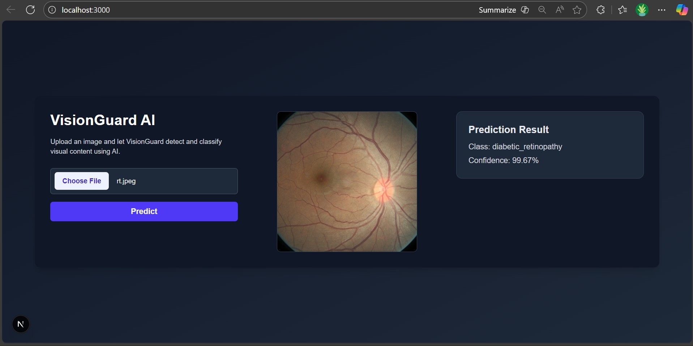

# VisionGuard

**VisionGuard** is a web-based image classification application powered by a custom Convolutional Neural Network (CNN). The system allows users to upload an image, and it predicts the class of the image along with a confidence score. It is designed to provide fast, accurate, and visually intuitive predictions, displaying results side-by-side with the uploaded image for a seamless user experience.

VisionGuard is built with a **FastAPI backend** for handling model inference and a **Next.js frontend** for a responsive, modern interface. The frontend communicates with the backend API to send images and receive predictions in real-time. The application supports both light and dark themes and offers a professional, clean UI suitable for both research and demonstration purposes.

Key features:

- Upload images and get real-time predictions
- Displays uploaded image and prediction side-by-side
- Confidence score for model predictions
- Clean, modern, and responsive UI with dark/light mode
- Easy to configure with your own trained CNN model
- Backend built with FastAPI and TensorFlow/PyTorch for flexibility

VisionGuard is suitable for applications like:

- Research and prototyping of image classification models
- Educational demos and AI showcases
- Lightweight deployment for custom image recognition tasks

## Demo



## Project Structure
```
VisionGuard/
│
├─ backend/                # FastAPI backend
│  ├─ app/
│  │  ├─ main.py           # FastAPI main application
│  │  ├─ model.py          # Model loading functions
│  │  └─ utils.py          # Image preprocessing & class definitions
│  └─ venv/                # Python virtual environment (optional)
│
├─ frontend/               # Next.js frontend
│  ├─ app/
│  │  └─ page.tsx          # Main page
│  ├─ services/
│  │  └─ api.ts            # API calls
│  ├─ globals.css           # Tailwind + custom styling
│  ├─ package.json
│  └─ tsconfig.json
│
└─ README.md
```

## Requirements

### Backend

- Python >= 3.10
- FastAPI
- Uvicorn
- TensorFlow / PyTorch (depending on your model)
- Pillow
- Other dependencies listed in `requirements.txt`

### Frontend

- Node.js >= 18
- npm
- Next.js
- Tailwind CSS (optional for styling)

---

## Backend Setup

1. **Navigate to the backend folder:**

```bash
cd VisionGuard/backend
python -m venv venv
venv\Scripts\activate
pip install fastapi uvicorn pillow tensorflow
pip install -r requirements.txt
exit
```

2. **Place your trained CNN model in the backend folder.**
The default path is specified in app/model.py:

MODEL_PATH = "app/my_cnn_model.h5

3. **Start the backend server:**
```bash
python -m uvicorn app.main:app --reload
```
4. **Access the backend API:**
   http://127.0.0.1:8000
## Frontend Setup
1. **Navigate to the frontend folder:**
```bash
cd VisionGuard/frontend
```
2. **Install dependencies:**
```bash

npm install
```
3. **Start the frontend server:**

```bash
npm run dev
```
4. **Start the frontend server:**
Frontend runs at:
```bash
http://localhost:3000
```
## Running the Application

```bash
cd VisionGuard/backend
venv\Scripts\activate
python -m uvicorn app.main:app --reload

cd VisionGuard/frontend
npm install
npm run dev
```

